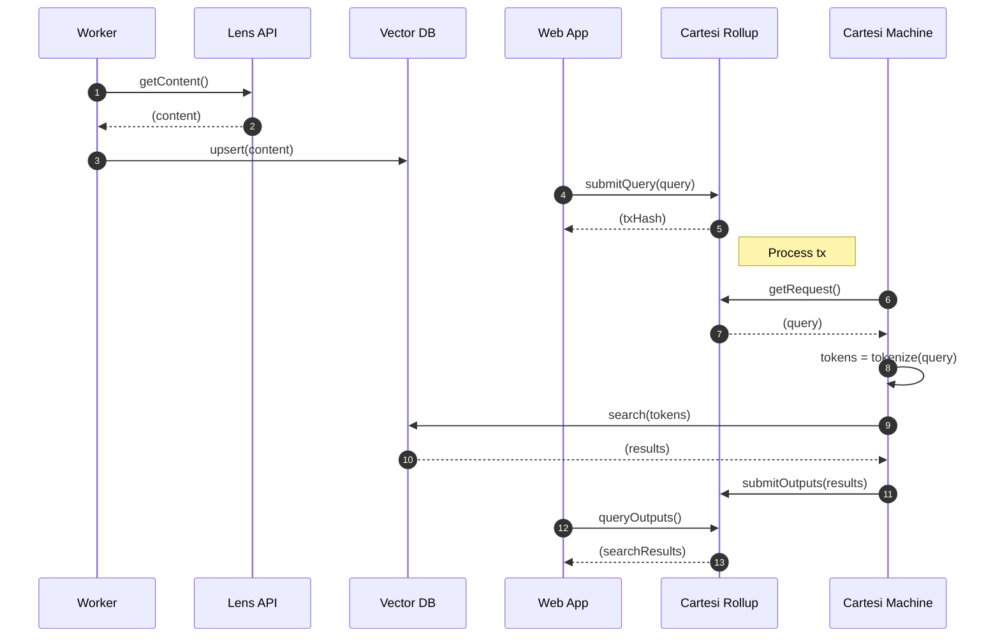
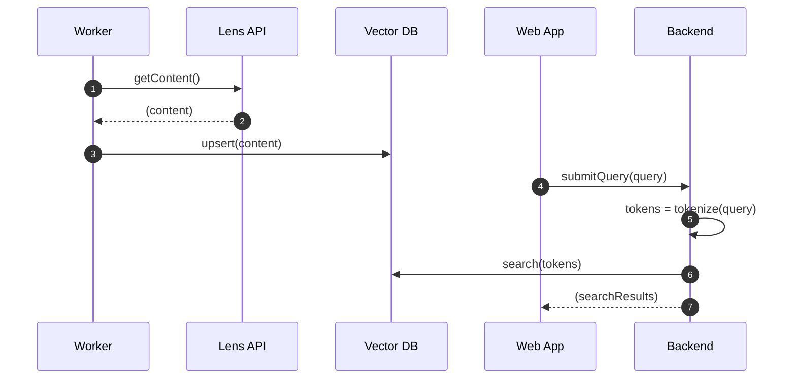

# lens-discovery-hackathon

Recommendation engine for Lens protocol, implemented with vector search and built on top of Cartesi rollup

## Architecture

### This is what we planned for

### This is what we got

